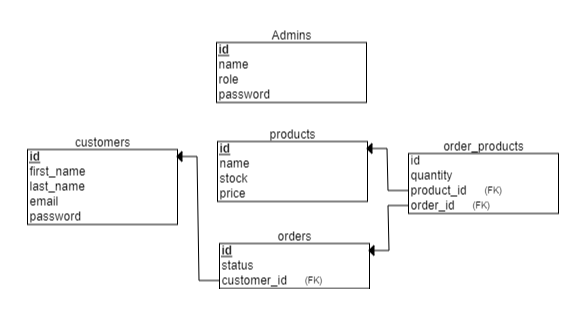

# Storefront Backend Project

## Table of contents

- [Storefront Backend Project](#storefront-backend-project)
  - [Table of contents](#table-of-contents)
  - [Overview](#overview)
  - [Built with](#built-with)
  - [project starter](#project-starter)
  - [Dependencies](#dependencies)
  - [Dev-dependencies](#dev-dependencies)
  - [files](#files)
  - [Run](#run)
  - [Database schema](#database-schema)
  - [End points](#end-points)
  - [Author](#author)

## Overview

[(Back to top)](#table-of-contents)

A RESTfull API for online store (solution for UDACITY project)

## Built with

[(Back to top)](#table-of-contents)

- Node.js
- express
- typescript
- javascript
- jasmine

## project starter

project starter is provided by udacity in this [repo](https://github.com/udacity/nd0067-c2-creating-an-api-with-postgresql-and-express-project-starter)

## Dependencies

[(Back to top)](#table-of-contents)

- [express](https://expressjs.com/)
- [helmet](https://www.npmjs.com/package/helmet)
- [morgan](https://www.npmjs.com/package/morgan)
- [apiCache](https://www.npmjs.com/package/apicache)
- [dotEnv](https://www.npmjs.com/package/dotenv)
- [postgreSQL](https://www.npmjs.com/package/pg)
- [db-migrate-pg](https://www.npmjs.com/package/db-migrate-pg)
- [db-migrate](https://www.npmjs.com/package/db-migrate)
- [CORS](https://www.npmjs.com/package/cors)
- [JSON web token](https://www.npmjs.com/package/json-web-token)

## Dev-dependencies

[(Back to top)](#table-of-contents)

- [eslint](https://www.npmjs.com/package/eslint)
- [jasmine](https://jasmine.github.io/)
- [typescript](https://www.typescriptlang.org/)

## files

[(Back to top)](#table-of-contents)

```cmd
 store-front-project-udacity
   ├─ .env.example
   ├─ .eslintignore
   ├─ .eslintrc.json
   ├─ database.json
   ├─ docker-compose.yml
   ├─ migrations
   │  ├─ 20220421215937-custmors.js
   │  ├─ 20220421220017-products.js
   │  ├─ 20220421220033-orders.js
   │  ├─ 20220421220059-order-products.js
   │  ├─ 20220429125600-admin.js
   │  └─ sqls
   │     ├─ 20220421215937-custmors-down.sql
   │     ├─ 20220421215937-custmors-up.sql
   │     ├─ 20220421220017-products-down.sql
   │     ├─ 20220421220017-products-up.sql
   │     ├─ 20220421220033-orders-down.sql
   │     ├─ 20220421220033-orders-up.sql
   │     ├─ 20220421220059-order-products-down.sql
   │     ├─ 20220421220059-order-products-up.sql
   │     ├─ 20220429125600-admin-down.sql
   │     └─ 20220429125600-admin-up.sql
   ├─ package-lock.json
   ├─ package.json
   ├─ README.md
   ├─ REQUIREMENTS.md
   ├─ spec
   │  └─ support
   │     └─ jasmine.json
   ├─ src
   │  ├─ database.ts
   │  ├─ handlers
   │  │  ├─ admin.ts
   │  │  ├─ customers.ts
   │  │  ├─ helpers
   │  │  │  ├─ adminCheck.ts
   │  │  │  ├─ checkEmail.ts
   │  │  │  ├─ checkName.ts
   │  │  │  ├─ idCheck.ts
   │  │  │  ├─ jwtAuth.ts
   │  │  │  ├─ orderStatusCheck.ts
   │  │  │  └─ roleCheck.ts
   │  │  ├─ order.ts
   │  │  └─ products.ts
   │  ├─ models
   │  │  ├─ admin.ts
   │  │  ├─ customer.ts
   │  │  ├─ order.ts
   │  │  └─ product.ts
   │  ├─ server.ts
   │  └─ tests
   │     ├─ handlers
   │     │  ├─ adminSpec.ts
   │     │  ├─ customerSpec.ts
   │     │  ├─ orderSpec.ts
   │     │  └─ productSpec.ts
   │     ├─ helpers
   │     │  └─ reporter.ts
   │     └─ models
   │        ├─ adminSpec.ts
   │        ├─ customerSpec.ts
   │        ├─ orderSpec.ts
   │        └─ productSpec.ts
   └─ tsconfig.json
```

## Run

This project can be run on a docker container.

- clone the project.
- make sure nodejs is installed on your pc.
- make your .env file with your environment variables.according to [.env.example](./.env.example) provided.
- run `docker-compose up` in your terminal.
- run `npm install` to install all dependencies.
- run `npm run migrate-up` to construct Database schema.
  _will construct database schema and a super admin with name and password from .env file_
- run `npm start` to start server on port `3000`.

## Database schema



## End points

end point requirement are provided [REQUIREMENTS.md](./REQUIREMENTS.md)

## Author

[(Back to top)](#table-of-contents)

- Github - [@Elbassel511](https://github.com/Elbassel511)
- Linked in - [@Hamada Elbassel](https://www.linkedin.com/in/hamadaelbassel/)
